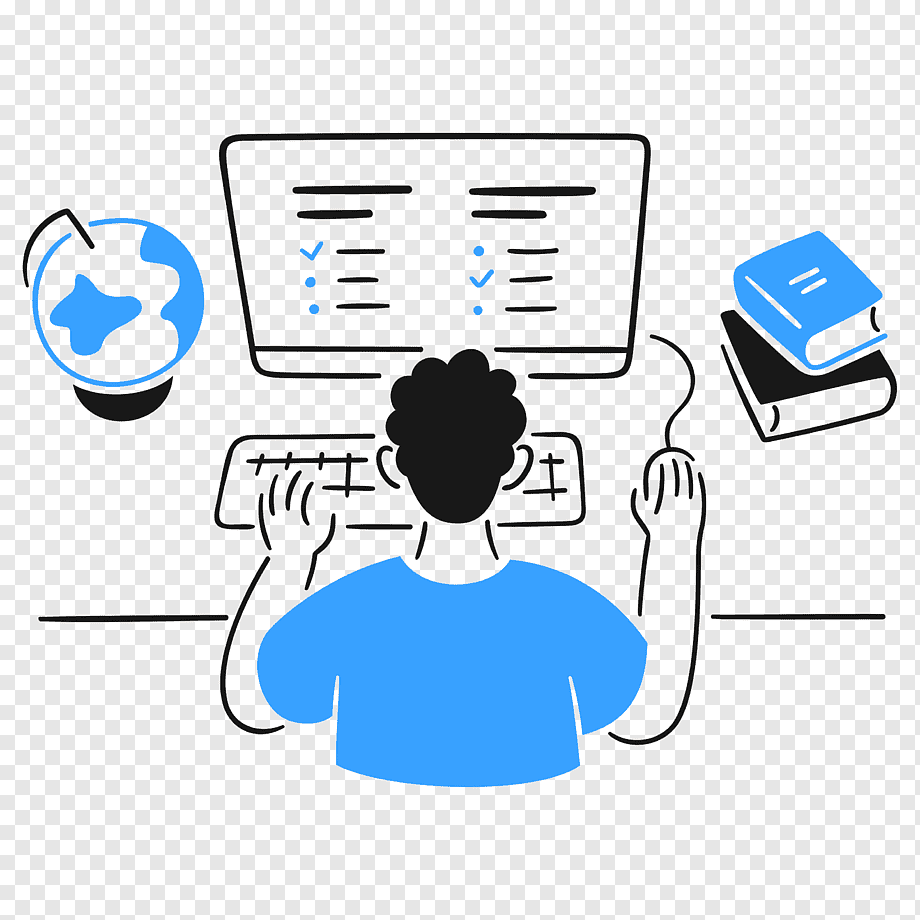
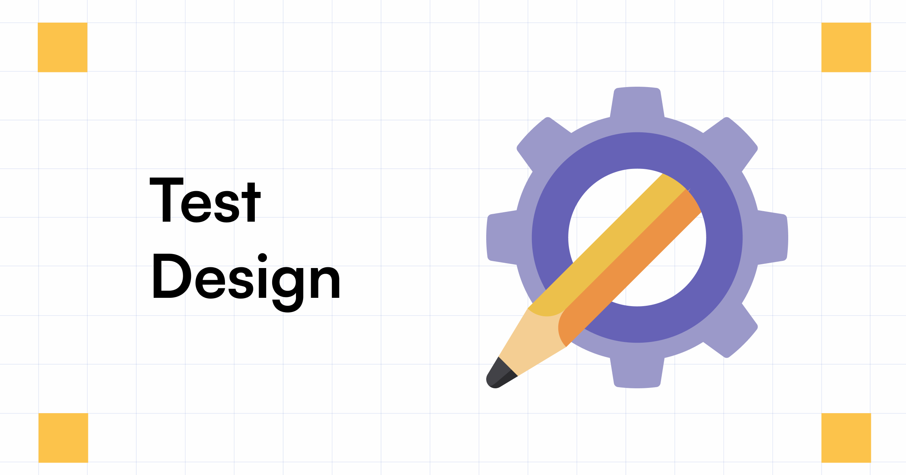

# Step #2. Using Platform API

In the previous section you've integrated your project with the engine code. As you remember, there are [several WIX apps](/docs/section-1/105-oneapp-product.md), each of which requires  a special it's own **Platform module**.

By default, when you launch your project, you will open a **Spaces app** and be prompted with **Home Screen** containing many **places**. This Home Screen is not part of the engine code, but belongs to **Platform module**.
The Platform module contains the cross-app UI and functionality of the Wix App.
It is the visual infrastructure on which different modules can present their screens or components.

The Platform exports different APIs for the various modules. We can use these APIs to expose our screens and functionalities to the user.
For example, in the previous section, in order to see your screen when you entered a place, you implemented **clientApps** API.

 In this section, we will learn about the Platform’s different APIs and how to use them in two apps:  
 - [Owner](#dashboard-view-wix-owner)
 - [Spaces](#member-view-wix-spaces)

The Platform is composed out of the Home Screen, which shows a list of all the places available for the user.
In case the user is not a manager of the place, he can click on the place and enter its **Member View**.
In case the user is a manager of a place, he can view the place's member view, and have a **Dashboard** button to open the Wix Owner application where the user can have access to their application's Dashboard View.

## Dashboard View (Wix Owner)

With the use of [**wix-owners-app-platform**](https://github.com/wix-private/wix-owners-app-platform/tree/master/packages/wix-owners-app-platform) user can update the application's components by using the dashboard view that it's part of the Wix Owner app. Please make sure you run your module in the Wix Owner app context.

### Quick Action

This is a simple API, that enables you to move quickly into one of your module’s screens. You can use it to reach some inner screen without entering a place, reaching your main screen, and going through an entire flow…

Just register your screen in the `module.ts` quick actions section.

```typescript
quickActionsServices(): QuickAction[] {
  const {Assets} = require('@wix/wix-react-native-ui-lib');

  return [{
    id: 'add-post-quick_action',
    label: 'Click Here to Reach Your Screen',
    icon: Assets.icons.general.arrowRight,
    screenId: 'addPostScreenId',
    testID: 'add-post-quick_action',
  }];
}

consumedServices() {
  return {
    quickActions: quickActionsServices,
  }
}
```

In the example above you see how to reach the *AddPost* screen directly while registering it in `module.ts` components section with the id - *‘addPostScreenId’*.

>1. Launch you admin project with:

```shono start --app admin```

>2. In your package.json --> oneAppEngine --> admin --> tabs --> add "plus" to the tabs array

>3. Now launch your admin project and click on the **Plus** tab.


>4. After clicking on the button, you should be prompted with the Quick Actions:


  
>5. Clicking this item will open your screen.

### Dashboard Widget

A dashboard widget enables a module to expose some functionality in the dashboard screen, without creating a whole screen. This helps the dashboard screen to remain clean and organized.The dashboard may contain many different widgets from different modules:


In the above screenshot you can see Payments, Forms Activity, and Media Storage examples for dashboard widgets.

Implement your own dashboard widget:

>1.  Create a new UI component to serve as your widget.

>2.  Expose your widget by implementing the **consumedServices** API in `module.ts`. You can read about it [here](https://bo.wix.com/wix-docs/mobile/one-app-platform/platform-apis/dashboard-widgets-api).

### Shortcuts

There is a way to add a shortcut to a specific screen in the app at the top of the Home Screen. You can read documentation [here](https://bo.wix.com/wix-docs/mobile/owner-app-platform/apis/shortcuts).

>1. Go to Dashboard and click on **Pen** icon.


>2. On the opened screen you will see available shortcuts (it depends on what modules you have installed in the app). Click on **Plus** icon. Click **Save**. You will see that the shortcut was added to the top of Home Screen.




## Member View (Wix Spaces)

Using [**wix-one-app-platform**](https://github.com/wix-private/wix-one-app-platform) you can run the Spaces app.

### Section

When we integrated our project with the engine code, we used **getClientApp**. This enabled us to present our main screen once we entered a place.

However, **getClientApp** is a deprecated API, which was used in the previous part for simplicity. 
Instead, when we want to show our screens in the **MemberView**, we should add them as a **Section**.

You can read about the sections and the member view structure [here](https://bo.wix.com/wix-docs/mobile/one-app-platform/member-view/intro).

For the member view, all definitions of what makes up a section and what sections are available (**SectionDefinitions** and the **Catalog**) are defined on server side. This is so that in the future it will be possible to edit your mobile place fully via a web interface.
You can read about it [here](https://bo.wix.com/wix-docs/mobile/one-app-platform/member-view/server-apis).

In order to keep things simple and avoid adding code to the server side, we will go through Section Definitions and check only build in elements.

>1. Go to **Site & App** tab and click **Customize**


>2. You see **Member View** now and can add **Sections**. Click on **Add Element** and play with existing elements.




### Header Action

Another way to customize the member view is to add a custom button to its header. This is called **HeaderAction**. You can read about it [here](https://bo.wix.com/wix-docs/mobile/one-app-platform/member-view/ctas).

In order to add your custom button, you need to add it to the catalog. As mentioned before, this is done through the server side, but for this tutorial we will go through build in buttons.

>1. Click on **Change Header Design** and then click on **Customize**


>2. Scroll to the bottom of the screen, and toggle the **Show Custom Button**. Then click on **Select button action** and take a look on buttons. You can change the **Button text** as well.


>3. Click **Save**. You should see the button you chose on the screen.


